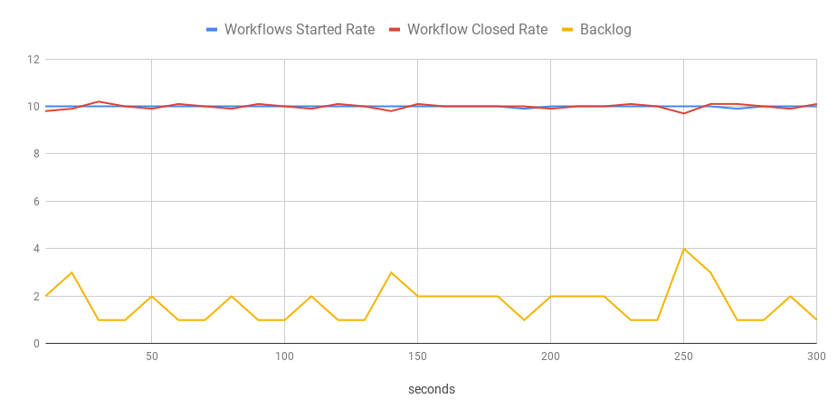
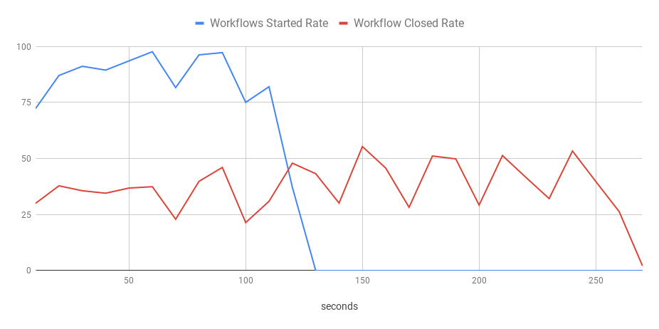
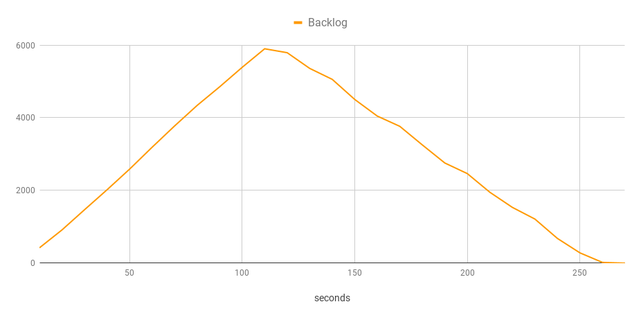

[Temporal](https://temporal.io) enables developers to build highly reliable applications without having to worry about all the edge cases. If you are new to Temporal, check out my article [Open Source Workflows as Code](https://mikhail.io/2020/10/temporal-open-source-workflows-as-code/).

Temporal is an open-source project, a system [consisting of several components](https://mikhail.io/2020/10/practical-approach-to-temporal-architecture/). While a managed Temporal service is coming, all the existing Temporal end-users administer and operate deployments themselves. Typically, the Temporal services run in a Kubernetes cluster. I described a sample Temporal installation in [How To Deploy Temporal to Azure Kubernetes Service (AKS)](https://mikhail.io/2020/11/how-to-deploy-temporal-to-azure-kubernetes-aks/).

Many Temporal newcomers have a reasonable question: *"What kind of infrastructure setup do I need to handle my target workload? What is the right capacity for a Kubernetes cluster, a persistent datastore, server components, and workers?”*

So a key goal became helping users answer the above question. I decided to create a load simulating tool that could be a practical first step in the capacity planning process. Here is the primary idea:

- Choose a supported persistence solution and deploy it or pay someone to run it (ideal)
- Build your Kubernetes cluster and deploy Temporal services to it.
- Deploy a **target** workflow that is a simplified representation of your real-life workflows.
- Also, deploy the **bench** workflow that I created. This specialized Temporal workflow orchestrates a load-test scenario, invokes the target workflow accordingly, and collects the execution statistics.

The bench workflow can give you the first approximation of whether the current cluster size would be sufficient for the target workload. For more detailed insights, you can also use tools like Prometheus and Grafana to observe the metrics and find issues.

Based on the statistics, you find a bottleneck, tweak the cluster size, persistence configuration, number of service instances, workers, shards, or a combination of those. Then, you re-run the tests and obtain the new results. Repeat the process until you are happy with the outcome.

Meet [Maru](https://github.com/temporalio/maru/)&mdash;an open-source load simulating tool for Temporal! You can give it a try today. The rest of this blog post describes the steps to get from nothing to the first benchmark results.

## Build a Temporal Cluster

A working Temporal Cluster is the first thing you need to run the benchmark. If you already have one, skip to the next section. Otherwise, you can build a sample AKS cluster with a compatible deployment of Temporal using [this Pulumi program](https://github.com/temporalio/maru/tree/master/pulumi).

For this blog post, I'm using a sample deployment that provisions the following resources:

- **Azure Kubernetes Service** managed cluster with three nodes of size `Standard_DS2_v2` (2 vCore, 7 GB RAM).
- **Temporal Helm chart** with all defaults, except Kafka is disabled. The Temporal service uses 512 history shards.
- In-cluster **Cassandra** as the datastore.
- **Elasticsearch** as the visibility store. Note: Elasticsearch is currently required for the benchmark.
- **Prometheus** and **Grafana**. I won't use those in this post, but they come in handy for performance deep-dives.

This setup is pretty basic and does not resemble a realistic production-grade deployment. It’s simply good enough for illustration purposes.

The next step is to define the target scenario for the load-testing.

## Target Workflow

The bench comes with a simple "basic" workflow that executes several sequential activities. The number of activities is configurable; I set it to three for the test run.

The basic workflow is just an example of a workflow that generates a very predictable workload. It makes sense to start with it, but you should adjust the target scenario to be closer to a real-life workload later on. There's no specific interface that such a workflow has to match: you can tweak it to your needs.

```go
// Workflow implements a basic bench scenario to schedule activities in sequence.
func Workflow(ctx workflow.Context, request workflowRequest) (string, error) {
   ao := workflow.ActivityOptions{ TaskQueue: common.TaskQueue }
   ctx = workflow.WithActivityOptions(ctx, ao)
   for i := 0; i < request.SequenceCount; i++ {
       var result string
       err := workflow.ExecuteActivity(ctx, "basic-activity", request.ActivityDurationMilliseconds).Get(ctx, &result)
       if err != nil {
           return "", err
       }
   }
   return request.ResultPayload, nil
}

// Activity sleeps and returns the result.
func Activity(ctx context.Context, req basicActivityRequest) (string, error) {
   time.Sleep(time.Duration(req.ActivityDelayMilliseconds) * time.Millisecond)   
   return req.ResultPayload, nil
}
```

## Bench Workflow

A simple configuration file drives the bench workflow. The file specifies the target workflow and the load scenario: how many executions to start per second and the total number of executions.

The bench has four sequential phases:

- **Driver** schedules target workflow executions according to the configured scenarios.
- **Monitor** queries the Temporal visibility database for open target workflows and waits until they all complete.
- **Statistic** queries all target workflow executions to collect the time they started and closed. It places each start and each close event to a bucket and builds a histogram.
- **Query** provides a query for users to retrieve the statistics.

```go
func (w *benchWorkflow) run() error {
   startTime := workflow.Now(w.ctx)
   for i, step := range w.request.Steps {
       if err := w.executeDriverActivities(i, step); err != nil {
           return err
       }
   }
   res, err := w.executeMonitorStatisicsActivity(startTime)
   if err != nil {
       return err
   }
   if err = w.setupQueries(res); err != nil {
       return err
   }
   return nil
}
```

## Worker

We deploy both target and bench as Temporal workflows to the same cluster. In my setup, they both run on the same worker (a Kubernetes deployment), but they could easily be split to separate workers. They do need to connect to the same Temporal service.

Now that I have my simple AKS cluster, a Temporal server, and workflows deployed to it. I'm ready to run my first benchmark!

## Run 1: 10 Executions per Second

For my first run, I have a test that runs for five minutes and creates ten workflow executions per second (3000 total). Here is the scenario definition for the bench:

```json
{
    "steps": [{
        "count": 3000,
        "ratePerSecond": 10
    }],
    "workflow": {
        "name": "basic-workflow",
        "args": {
            "sequenceCount": 3
        }
    },
    "report": {
        "intervalInSeconds": 10
    }
}
```

The `steps[0].count` is calculated as `10 wf/sec * 60 sec/min * 5 min = 3,000 wf`.

I start the benchmark by running this command (read [here](https://docs.temporal.io/docs/tctl/) how to connect the CLI to your cluster):

```bash
tctl wf start --tq temporal-bench --wt bench-workflow --wtt 5 --et 1800 --if ./scenarios/run1.json --wid run1
```

Then, I wait for five minutes and query the results.

```bash
tctl wf query --qt histogram_csv --wid run1
```

The response of the query is a CSV file with the bench statistics: see the file here. I can import this file to Google Spreadsheets and visualize it in a chart like this one:



You can see that the test ran for five minutes, and the bench started workflows at the constant rate of 10 per second. They were also closed at the same speed with only a handful of open executions at any moment.

This test clearly shows that my current deployment is sufficient to handle this type of workload.

## Run 2: 100 Executions per Second

Let's bump the rate to 100 per second (10x compared to Run 1). Here is the scenario file:

```json
{
    "steps": [{
        "count": 10000,
        "ratePerSecond": 100
    }],
    "workflow": {
        "name": "basic-workflow",
        "args": {
            "sequenceCount": 3
        }
    },
    "report": {
        "intervalInSeconds": 10
    }
}
```

Using the same command sequence as above, I get the following chart of started and closed workflows.



You can see that it's not smooth anymore. The bench failed to start 100 workflow executions per second consistently, and the processing rate oscillated around 35 executions per second. This delay caused the backlog to grow while new executions were being added continually. The backlog started to decrease only after the bench stopped scheduling executions.



Clearly, the system in its current configuration isn't capable of processing this workload. I would guess this may be caused by contention in the datastore (Cassandra), but that's a topic for another blog post.

Nonetheless, all the executions eventually succeeded, and no work has been lost. Temporal retained its high-reliability guarantees even with a severely underprovisioned cluster. Great job!

I want to emphasize that this test does not show any fundamental limitations of the Temporal server. I ran it in a small cluster with all the default configuration knobs, which means there was a single instance of each Temporal server component and a single worker, for example.

## How You Can Get Started

[Maru, a Temporal Load Simulator tool](https://github.com/temporalio/maru) is now open-source. I encourage everyone to give it a try to benchmark their own setups. Please file an issue if you have ideas on how to make the tool better.

I'm planning to describe how the benchmark works, tune underperforming clusters, and conduct other experiments in my follow-up blog posts. Stay tuned!
