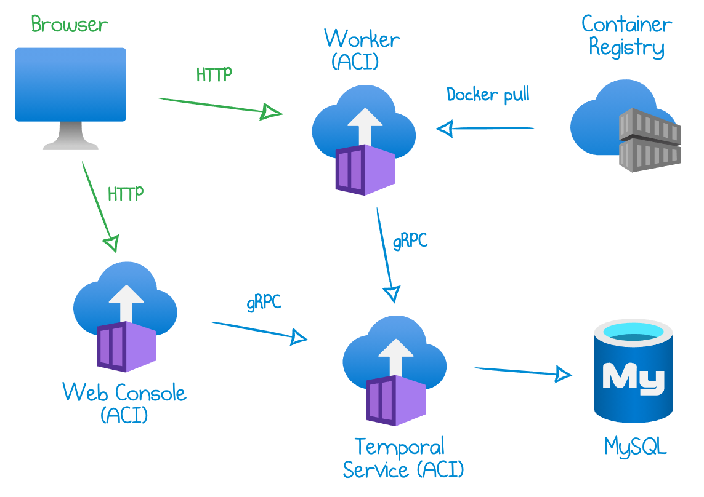

In [my previous article](https://mikhail.io/2020/10/practical-approach-to-temporal-architecture/), I outlined the various components of [Temporal](https://temporal.io) and how they interact. Today's blog builds on this knowledge and demonstrates an example Temporal deployment.

It's a minimalistic deployment on Azure which combines a managed MySQL database with Azure Container Instances, suitable for simple experimentation and development. Here is a diagram of the cloud infrastructure:



This sample deployment is implemented as a [Pulumi](https://pulumi.com) program in TypeScript. You can find the full code in [my GitHub](https://github.com/mikhailshilkov/temporal-samples/tree/main/azure-aci).

## Application Code

The `workflow` folder contains all of the application code. The application is written with Go and consists of two source files:

1. `helloworld.go` - defines a workflow and an activity
2. `main.go` - application entry point.

The example deploys a "Hello World" Temporal application copied from [this Go sample](https://github.com/temporalio/samples-go/blob/master/helloworld/helloworld.go). Once you get it up and running, you can certainly customize the code with your own workflow and activities.

The `main.go` file does two things. First, it spins up a worker:

```go
w := worker.New(c, "hello-world", worker.Options{})
w.RegisterWorkflow(helloworld.Workflow)
w.RegisterActivity(helloworld.Activity)
```

Second, it launches an HTTP server in the same process. The server exposes endpoints to start workflows. The `/async?name=<yourname>` endpoint starts a new workflow and immediately returns, while the `/sync?name=<yourname>` blocks and waits for the result of the execution and returns the response. You can find the implementation in the [`start`](https://github.com/mikhailshilkov/temporal-samples/blob/33024f614d4a99a7700eacf2142c8ef2b7cea0fc/azure-aci/workflow/main.go#L22) function.

## Docker Image

Since the application is deployed to Azure Container Instances, we need to produce a custom Docker image. [The `Dockerfile`](https://github.com/mikhailshilkov/temporal-samples/blob/33024f614d4a99a7700eacf2142c8ef2b7cea0fc/azure-aci/workflow/Dockerfile) builds the Go application and exposes port `8080` to the outside world so we can access the starter HTTP endpoints.

Pulumi deploys this `Dockerfile` to Azure in three steps:

- [Deploy](https://github.com/mikhailshilkov/temporal-samples/blob/33024f614d4a99a7700eacf2142c8ef2b7cea0fc/azure-aci/temporal.ts#L99-L107) an Azure Container Registry.
- [Retrieve](https://github.com/mikhailshilkov/temporal-samples/blob/33024f614d4a99a7700eacf2142c8ef2b7cea0fc/azure-aci/temporal.ts#L109-L115) the registry's admin credentials generated by Azure.
- [Publish](https://github.com/mikhailshilkov/temporal-samples/blob/33024f614d4a99a7700eacf2142c8ef2b7cea0fc/azure-aci/temporal.ts#L117-L125) the application image to the registry.

## MySQL Database

There are several persistence options supported by Temporal. A straightforward option in Azure is to deploy an instance of Azure Database for MySQL. It's a fully managed database service where Azure is responsible for uptime and maintenance, and users pay a flat fee per hour.

My example [provisions](https://github.com/mikhailshilkov/temporal-samples/blob/f17738aff73ae88e1b5f503790e9247f40f88b38/azure-aci/mysql.ts#L24-L50) an instance of MySQL 5.7 at the Basic tier. The database size is limited to 5 GB.

A final tweak is to [add](https://github.com/mikhailshilkov/temporal-samples/blob/f17738aff73ae88e1b5f503790e9247f40f88b38/azure-aci/mysql.ts#L52-L58) a firewall rule for the IP address `0.0.0.0`, which enables network access to MySQL from any Azure service. Note that this option isn't secure for production workloads: read more in [Connecting from Azure](https://docs.microsoft.com/en-us/azure/mysql/concepts-firewall-rules#connecting-from-azure).

## Temporal Service and Web Console

Next, we deploy the Temporal Service and Temporal Web Console as two Azure Container Instances.

The Service container:

- [Refers](https://github.com/mikhailshilkov/temporal-samples/blob/f17738aff73ae88e1b5f503790e9247f40f88b38/azure-aci/temporal.ts#L56) to the `temporalio/server` Docker image provided by Temporal.
- [Sets up](https://github.com/mikhailshilkov/temporal-samples/blob/f17738aff73ae88e1b5f503790e9247f40f88b38/azure-aci/temporal.ts#L34-L43) environment variables to connect to MySQL.
- [Exposes](https://github.com/mikhailshilkov/temporal-samples/blob/f17738aff73ae88e1b5f503790e9247f40f88b38/azure-aci/temporal.ts#L51-L52) port `7233` to the outside world. Note that this is not secure for a production environment!

The Web Console container:

- [Refers](https://github.com/mikhailshilkov/temporal-samples/blob/f17738aff73ae88e1b5f503790e9247f40f88b38/azure-aci/temporal.ts#L82) to the `temporalio/web` Docker image provided by Temporal.
- [Connects](https://github.com/mikhailshilkov/temporal-samples/blob/f17738aff73ae88e1b5f503790e9247f40f88b38/azure-aci/temporal.ts#L91) to the gRPC endpoint gathered from the Service container.
- [Exposes](https://github.com/mikhailshilkov/temporal-samples/blob/f17738aff73ae88e1b5f503790e9247f40f88b38/azure-aci/temporal.ts#L77-L78) port `8088` to the outside world. Note that this is not secure for a production environment!

## Temporal Worker

The final component is a Temporal worker that runs application workflows and activities. In my setup, the worker is another Azure Container Instance that pulls the custom Docker image from the container registry. The worker container:

- [Refers](https://github.com/mikhailshilkov/temporal-samples/blob/f17738aff73ae88e1b5f503790e9247f40f88b38/azure-aci/temporal.ts#L143) to the custom Docker image created above.
- [Connects](https://github.com/mikhailshilkov/temporal-samples/blob/f17738aff73ae88e1b5f503790e9247f40f88b38/azure-aci/temporal.ts#L152) to the gRPC endpoint gathered from the Service container.
- [Configures](https://github.com/mikhailshilkov/temporal-samples/blob/f17738aff73ae88e1b5f503790e9247f40f88b38/azure-aci/temporal.ts#L136-L140) registry credentials to access the private Azure Container Registry.
- [Exposes](https://github.com/mikhailshilkov/temporal-samples/blob/f17738aff73ae88e1b5f503790e9247f40f88b38/azure-aci/temporal.ts#L77-L78) the starter endpoints at the port `8080`.

## Get Started

The Pulumi Command-Line Interface (CLI) runs the deployment. [Install Pulumi](https://www.pulumi.com/docs/get-started/install/), navigate to the folder where you have the example cloned, and run the following commands:

1. Create a new stack (a Pulumi deployment environment):

```bash
pulumi stack init dev
```

2. Login to [Azure CLI](https://docs.microsoft.com/en-us/cli/azure/install-azure-cli):

```bash
az login
```

3. Install NPM dependencies:

```bash
npm install
```

4. Run `pulumi up` and confirm when asked if you want to deploy. Azure resources are provisioned:

```bash
$ pulumi up
...
Performing changes:
  Type                                                         Name                    Status
  pulumi:pulumi:Stack                                          temporal-azure-aci-dev  created
  ├─ my:example:MySql                                          mysql                   created
  │  ├─ azure-nextgen:dbformysql/latest:Server                 mysql                   created
  │  └─ azure-nextgen:dbformysql/latest:FirewallRule           mysql-allow-all         created
  ├─ my:example:Temporal                                       temporal                created
  │  ├─ docker:image:Image                                     temporal-worker         created
  │  ├─ azure-nextgen:containerregistry/latest:Registry        registry                created
  │  ├─ azure-nextgen:containerinstance/latest:ContainerGroup  temporal-server         created
  │  ├─ azure-nextgen:containerinstance/latest:ContainerGroup  temporal-web            created
  │  └─ azure-nextgen:containerinstance/latest:ContainerGroup  temporal-worker         created
  ├─ random:index:RandomString                                 resourcegroup-name      created
  ├─ random:index:RandomPassword                               mysql-password          created
  └─ azure-nextgen:resources/latest:ResourceGroup              rg                      created

Outputs:
    serverEndpoint : "21.55.179.245:7233"
    starterEndpoint: "http://21.55.177.186:8080/async?name="
    webEndpoint    : "http://52.136.6.198:8088"

Resources:
    + 13 created

Duration: 7m48s
```

5. The output above prints the endpoints to interact with the application. Run the following command to start a "Hello World" workflow:

```bash
curl $(pulumi stack output starterEndpoint)World
Started workflow ID=World, RunID=b4f6db00-bb2f-498b-b620-caad81c91a81%
```

Now, open the `webEndpoint` URL in your browser and find the workflow (it's probably already in the Completed state).

## Cost, Security, and Further Steps

The deployment above provisions real Azure resources, so be mindful of the related costs. Here is an estimated calculation for the "West US 2" region:

- Azure Database for MySQL Gen5 Basic with 1 vCore and 5 GB of storage = $25.32/month
- Azure Container Instance with 1 vCPU and 1 GB of RAM: 3 x $32.36/month = $97.08/month
- Azure Container Registry Basic = $5.00/month

The total cost for this example is approximately $127.40 per month.

Whenever you are done experimenting, run `pulumi destroy` to delete the resources. Note that all the data will be lost after destruction.

As noted in the sections above, the security setup is minimal and is not suitable for any environment that processes real data. In addition to a secure networking setup, a production environment would need to handle scalability, resilience, backups, observability, and so on.

I plan to address those topics in future blog posts. Stay tuned!

You can find the full code in [my GitHub](https://github.com/mikhailshilkov/temporal-samples/tree/main/azure-aci).