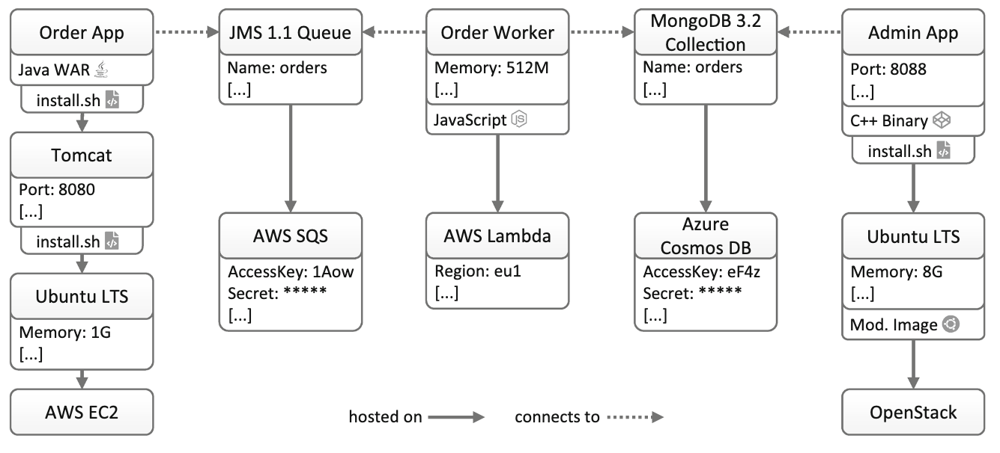
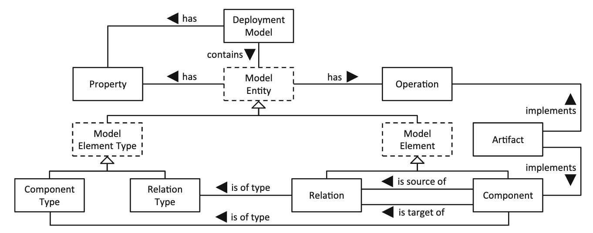

## The essential deployment metamodel: a systematic review of deployment automation technologies (2019)

https://link.springer.com/content/pdf/10.1007/s00450-019-00412-x.pdf

The paper identifies relevant cloud deployment technologies: Puppet, Chef, Ansible, Kubernetes, OpenStack HEAT, Terraform, AWS CloudFormation, SaltStack, Juju, CFEngine, Azure Resource Manager, Docker Compose, Cloudify.

It gives an example of an application deployment, consisting of components and relations of two types:

It classifies the technologies as General-Purpose, Provider-Specific, and Platform-Specific.

It defines an Essential Deployment Metamodel (EDMM) - a model to represent cloud deployments:

It then shows that the model is generic enough to map it to every technology in the list.

"A understanding of essential deployment model elements helps to compare technologies regarding deployment features and mechanism and supports decision making processes when selecting an appropriate technology for an use case. The introduced classification and the presented EDMM technology mapping support the migration from one deployment technology into another one. Further, this does not only support industry to compare and select technologies, but also helps researcher to evaluate concepts in the area of deployment automation research: If new research can be realized using EDMM, our mappings prove that this research can be also applied to the technologies analyzed in this paper. This significantly eases practically validating new concepts."

## Cloud-native Deploy-ability: An Analysis of Required Features of Deployment Technologies to Deploy Arbitrary Cloud-native Applications (2019)

https://www.scitepress.org/Link.aspx?doi=10.5220%2f0009571001710180 (downloaded in the folder)

It build on another paper (Kratzke and Quint (2017)) to define what Cloud-Native means:

- Service-based Architectures
- API-based Interactions
- State Isolation
- Self-contained Service Deployment
- Disposability
- Fault-resilience
- Infrastructure Abstraction
- Infrastructure as Code
- Policy-driven Elasticity
- CI/CD Compliance

It then discusses what are some requirements for deployment of Cloud-Native apps.

Cloud-native Deploy-ability: describes the ability to deploy arbitrary application components, concerning all cloud service models, that can be vertically “hosted on” or horizontally “connected to” any other component or service hosted on any cloud provider, cloud platform, or hy- brid environment. This includes support- ing the processing of declarative deploy- ment models given in machine-readable formats fostering automation.

Support for Multiple Cloud Providers and Platforms
Support for All Cloud Service Models (XaaS)
Usage of Deployment Models Supporting Arbitrary Components

It then takes the EDMM model from the above paper and basically argues that this is a useful way to describe cloud-native deployments.