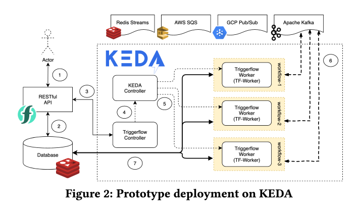

## FaaS Orchestration of Parallel Workloads (Dec 2019)

https://dl.acm.org/doi/pdf/10.1145/3366623.3368137

It compares serverless orchestration tools like AWS Step Functions or Azure DurableFunctions in terms of performance overhead. It concludes that OpenWhisk Composer is more efficient for the presented benchmarks.

However, Composer has a syncrhonous wait, which makes it non-suitable for long-ish workflow. They suggest an improvement to make Composer more reactive, non-blocking, and tolerant to long delays.

The paper is affiliated with IBM and seems to be biased.

## Triggerflow: Trigger-based Orchestration of Serverless Workflows (Jun 2020)

https://arxiv.org/pdf/2006.08654v2.pdf

The paper is again affiliated with IBM, it's using open-source FaaS frameworks, but seems to be less biased towards IBM tech in particular.

The major contributions of this paper are the following:

1. We present a Rich Trigger framework following: an Event-Condition-Action (ECA) architecture that is extensible atall levels (Event Sources and Programmable Conditions andActions). Our architecture ensures that composite eventdetection and event routing mechanisms are mediated byreactive event-based middleware.
 
2. We demonstrate Triggerflow's extensibility and universal-ity creating atop it a state machine workƒow scheduler,a DAG engine, an imperative Workƒow as Code (usingevent sourcing) scheduler, and integration with an exter-nal scheduler like PyWren. We also validate performanceand overhead of our scheduling solutions compared toexisting Cloud Serverless Orchestration systems like Ama-zon Step Functions, Amazon Express Workƒows, AzureDurable Functions and IBM Composer.
 
3. We finally propose a generic implementation of our modelover standard CNCF Cloud technologies like Kubernetes,Knative Eventing and CloudEvents. We validate that oursystem can support high-volume event processing work-loads, auto-scale on demand and transparently optimize sci-enti€c workƒows. Œe project is available as open-sourcein [1]

They show a theoretic definition of what a workflow orchestration should contain, and then describe the implementations on a) Knative b) KEDA.

It's a bit hard to grasp the exact implementation details of the paper, but there is source code available at https://github.com/triggerflow/triggerflow (in Python).

They describe mappings from DAG, State Machines, and Workflow-as-Code implementations to Triggerflow.

They evaluate scaling and performance characteristics on KEDA. It looks okay but not a large-scale scenario.

## Wukong: A Scalable and Locality-EnhancedFramework for Serverless Parallel Computing (Oct 2020)

https://arxiv.org/pdf/2010.07268v1.pdf

It's a bit hard to grasp the exact value of this beyond the scientici specialized examples that they show.

Executing complex, burst-parallel, directed acyclic graph (DAG) jobs poses a major challenge for serverless executionframeworks, which will need to rapidly scale and scheduletasks at high throughput, while minimizing data movementacross tasks. We demonstrate that, for serverless parallel com-putations, decentralized scheduling enables scheduling to bedistributed across Lambda executors that can schedule tasksin parallel, and brings multiple benefits, including enhanceddata locality, reduced network I/Os, automatic resource elas-ticity, and improved cost effectiveness. We describe the im-plementation and deployment of our new serverless parallelframework, calledWukong, on AWS Lambda.
