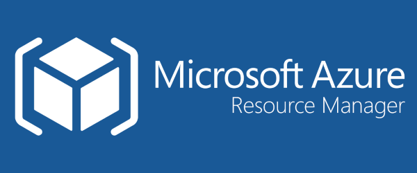

Welcome to a hands-on, self-paced lab about [Azure Resource Manager Templates](https://docs.microsoft.com/en-us/azure/templates/)!

With no prior experience required, you will learn the basics of ARM Templates. You will provision an **Azure Function App** with all required dependencies and will get a simple but fully working serverless application up and running.

#### Summary

The lab is a step-by-step tutorial that guides you through the process of **building a simple serverless application**. We focus on automating infrastructure provisioning rather than writing application code.

In about an hour or so, you learn about Resource Groups, Storage Accounts, App Service Plans, and Function Apps in Azure. You define infrastructure as **a JSON template** and provision it from the command-line interface.

#### Target Audience

The lab assumes basic familiarity with Azure services listed above. But even if you are very new to Azure, you'll be able to follow along and look up additional information in Azure docs as you go.

No prior experience with ARM Templates is required.