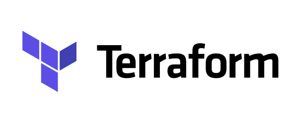

Welcome to a hands-on, self-paced lab focused on Terraform and Azure!

With no prior experience required, you will learn the basics of Terraform and its Azure provider. You will provision an Azure Function App with all required dependencies and will get a simple but fully working serverless application up and running.